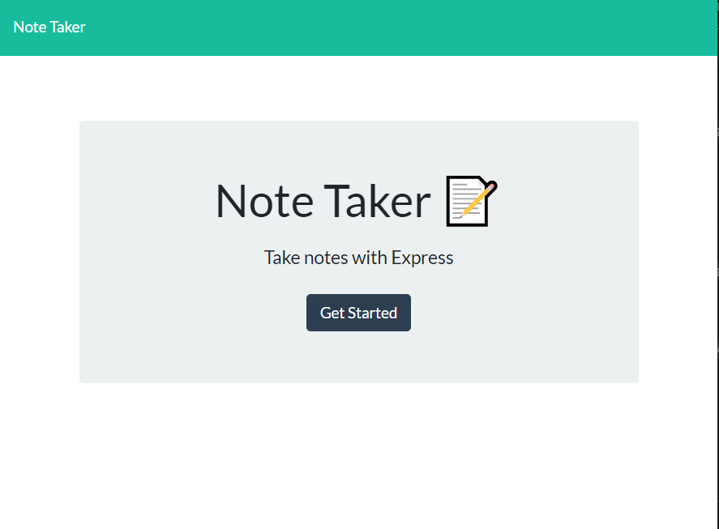

# Note taker

## Description
This webpage is a note taking application using Express.js backend using JSON to save and retrieve notes. 

## Installation 
This application stores the notes data locally in a JSON file. To use the app, you will need to follow the following instructions to install to your local machine. 

> Clone the app
```
> git clone (clone_addess) 
```
> Initialise and installing necessary packages for npm
```
> npm init -y
> npm install
> npm install nodemon --save-dev
```

## Usage
> Start nodemon by running the following command on the command line terminal
```
> npm start nodemon server.js
```
> Open the link to the server on your browser: 
```
http://localhost:3001/
```

Below is a short video to illustrate the usage of the note taking app, please click on the image to view: [](https://drive.google.com/file/d/1RcxB3HCQKA3yVrKxkvo1n3q_3whaDAbu/view)

## Link to deployed application
Alternatively, a demo of the app is already deployed on [heroku](https://jb-note-taker-wk11.herokuapp.com/)